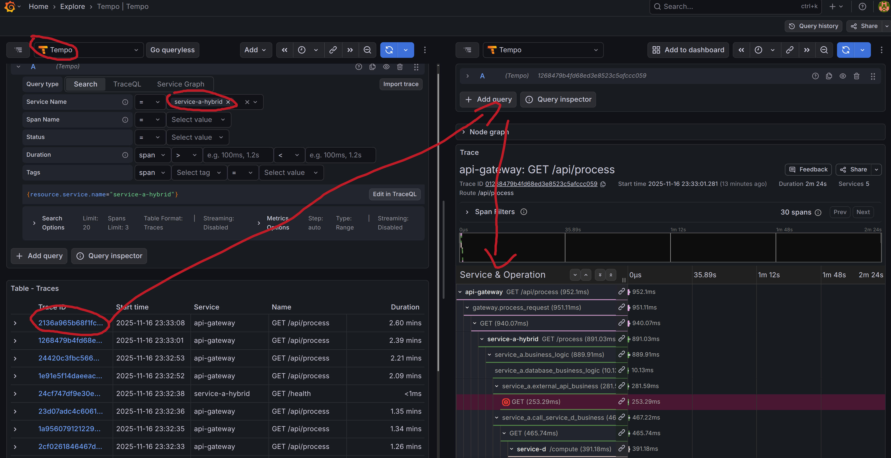
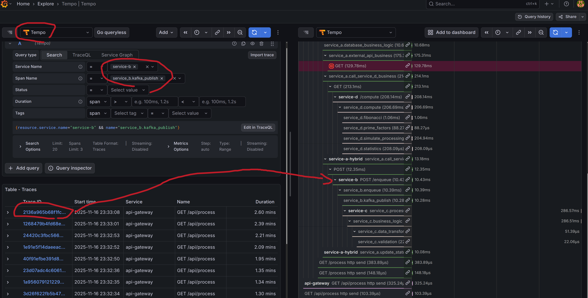

author: Your Name
summary: OpenTelemetry 可觀測性實驗室完整教學
id: o11y-lab-tutorial
categories: observability,opentelemetry,docker
environments: Web
status: Published
feedback link: https://github.com/yourusername/o11y_lab_for_dummies
analytics account: Google Analytics ID

# OpenTelemetry 可觀測性實驗室教學

## 課程簡介
Duration: 2

### 你將學到什麼

在這個實驗室中，你將學習如何：

- 搭建完整的可觀測性環境（Grafana + Prometheus + Loki + Tempo）
- 使用 Docker Compose 快速部署微服務架構
- 理解 Python 自動埋點（Auto Instrumentation）
- 實踐 Python 手動埋點（Manual Instrumentation）
- 使用 K6 生成測試流量
- 使用 Pumba 進行混沌工程（延遲注入）
- 在 Grafana 中關聯 Logs、Metrics、Traces

### 前置要求

- 基本的 Linux 命令列知識
- 理解 Docker 基礎概念
- Python 或 Go 程式設計基礎

### 實驗環境

- Ubuntu/MacOS/Windows (WSL2)
- 至少 8GB RAM
- 20GB 可用磁碟空間

---

## 環境準備 - Docker & Docker Compose
Duration: 10

### 安裝 Docker

#### Linux (Ubuntu/Debian)

```bash
# 更新軟體套件索引
sudo apt-get update

# 安裝相依套件
sudo apt-get install -y \
    ca-certificates \
    curl \
    gnupg \
    lsb-release

# 新增 Docker 官方 GPG key
sudo mkdir -p /etc/apt/keyrings
curl -fsSL https://download.docker.com/linux/ubuntu/gpg | sudo gpg --dearmor -o /etc/apt/keyrings/docker.gpg

# 設定儲存庫
echo \
  "deb [arch=$(dpkg --print-architecture) signed-by=/etc/apt/keyrings/docker.gpg] https://download.docker.com/linux/ubuntu \
  $(lsb_release -cs) stable" | sudo tee /etc/apt/sources.list.d/docker.list > /dev/null

# 安裝 Docker Engine
sudo apt-get update
sudo apt-get install -y docker-ce docker-ce-cli containerd.io docker-buildx-plugin docker-compose-plugin

# 將目前使用者加入 docker 群組
sudo usermod -aG docker $USER
newgrp docker
```

#### MacOS

```bash
# 使用 Homebrew 安裝
brew install --cask docker

# 或者直接下載 Docker Desktop
# https://www.docker.com/products/docker-desktop/
```

#### Windows

下載並安裝 Docker Desktop for Windows:
https://www.docker.com/products/docker-desktop/

### 驗證安裝

```bash
# 檢查 Docker 版本
docker --version
# 應顯示: Docker version 24.0.0 或更高

# 檢查 Docker Compose
docker compose version
# 應顯示: Docker Compose version v2.20.0 或更高

# 測試 Docker 運作
docker run hello-world
```

Positive
: 如果看到 "Hello from Docker!" 訊息，表示 Docker 安裝成功！

---

## 環境準備 - Python & Go
Duration: 8

### 安裝 Python 3.11+

#### Linux (Ubuntu/Debian)

```bash
# 新增 deadsnakes PPA
sudo add-apt-repository ppa:deadsnakes/ppa
sudo apt-get update

# 安裝 Python 3.11
sudo apt-get install -y python3.11 python3.11-venv python3.11-dev

# 安裝 pip
curl -sS https://bootstrap.pypa.io/get-pip.py | python3.11

# 驗證安裝
python3.11 --version
pip3.11 --version
```

#### MacOS

```bash
brew install python@3.11

# 驗證
python3.11 --version
```

#### Windows

下載並安裝 Python 3.11:
https://www.python.org/downloads/

### 安裝 Go 1.21+

#### Linux

```bash
# 下載 Go
wget https://go.dev/dl/go1.21.5.linux-amd64.tar.gz

# 解壓縮到 /usr/local
sudo rm -rf /usr/local/go
sudo tar -C /usr/local -xzf go1.21.5.linux-amd64.tar.gz

# 新增到 PATH (加入 ~/.bashrc 或 ~/.zshrc)
echo 'export PATH=$PATH:/usr/local/go/bin' >> ~/.bashrc
source ~/.bashrc

# 驗證
go version
```

#### MacOS

```bash
brew install go@1.21

# 驗證
go version
```

#### Windows

下載並安裝 Go:
https://go.dev/dl/

### 安裝 K6

K6 是一個現代化的負載測試工具。

#### Linux

```bash
sudo gpg -k
sudo gpg --no-default-keyring --keyring /usr/share/keyrings/k6-archive-keyring.gpg --keyserver hkp://keyserver.ubuntu.com:80 --recv-keys C5AD17C747E3415A3642D57D77C6C491D6AC1D69
echo "deb [signed-by=/usr/share/keyrings/k6-archive-keyring.gpg] https://dl.k6.io/deb stable main" | sudo tee /etc/apt/sources.list.d/k6.list
sudo apt-get update
sudo apt-get install k6

# 驗證
k6 version
```

#### MacOS

```bash
brew install k6

# 驗證
k6 version
```

#### 使用 Docker (跨平台)

```bash
docker pull grafana/k6:latest
docker run --rm -i grafana/k6 version
```

Positive
: 所有工具安裝完成！現在可以開始實驗了。

---

## 複製專案並啟動環境
Duration: 5

### 取得專案程式碼

```bash
# 複製儲存庫
git clone https://github.com/yourusername/o11y_lab_for_dummies.git
cd o11y_lab_for_dummies

# 查看專案結構
ls -la
```

### 啟動所有服務

```bash
# 使用 Docker Compose 啟動
docker compose up -d

# 查看服務狀態
docker compose ps

# 查看日誌（選用）
docker compose logs -f
```

你應該會看到以下服務啟動：

- **api-gateway**: Python FastAPI 閘道器
- **service-a**: Python FastAPI 服務（自動埋點）
- **service-b**: Go 服務（手動埋點）
- **service-c**: Go 服務（手動埋點）
- **service-d**: Python Flask 服務（自動埋點）
- **grafana**: 視覺化平台
- **prometheus**: Metrics 儲存
- **loki**: 日誌儲存
- **tempo**: Trace 儲存
- **otel-collector**: OpenTelemetry 收集器
- **postgres**: 資料庫
- **kafka**: 訊息佇列

### 等待服務就緒

```bash
# 檢查所有容器是否健康
docker compose ps

# 等待約 30-60 秒讓所有服務啟動完成
```

Positive
: 所有服務啟動後，我們就可以存取 Grafana 了！

---

## 存取 Grafana 平台
Duration: 10

### 登入 Grafana

1. 開啟瀏覽器存取: **http://localhost:3000**

2. 使用預設憑證登入:
   - **使用者名稱**: `admin`
   - **密碼**: `admin`

3. 首次登入會提示修改密碼，可以選擇跳過（Skip）

### Grafana 介面介紹

登入後你會看到 Grafana 主介面：


#### 左側選單列

- **Home**: 首頁
- **Dashboards**: 儀表板清單
- **Explore**: 資料探索介面（我們主要使用這個）
- **Alerting**: 告警配置
- **Configuration**: 配置選項

### 查看資料來源

1. 點擊左側選單的齒輪圖示 (Configuration)
2. 選擇 **Data sources**
3. 你應該會看到以下資料來源已配置:
   - **Prometheus**: Metrics 資料
   - **Loki**: 日誌資料
   - **Tempo**: Trace 資料


### 探索預先配置的 Dashboard

1. 點擊左側選單的 Dashboard 圖示
2. 你會看到預先配置的儀表板:
   - **OpenTelemetry Overview**: 整體概覽
   - **Service Performance**: 服務效能監控
   - **Distributed Tracing**: 分散式追蹤


Positive
: Grafana 平台已經準備好了！接下來我們將使用 K6 生成流量。

---

## 使用 K6 生成測試流量
Duration: 8

### K6 測試腳本

專案中已經包含了 K6 測試腳本。讓我們查看並執行它：

```bash
# 查看 K6 腳本（如果存在）
cat k6/load-test.js
```

如果專案中沒有，建立一個簡單的 K6 腳本：

```bash
mkdir -p k6
cat > k6/load-test.js << 'EOF'
import http from 'k6/http';
import { check, sleep } from 'k6';

export const options = {
  stages: [
    { duration: '30s', target: 10 },  // 爬升到 10 個使用者
    { duration: '1m', target: 10 },   // 保持 10 個使用者
    { duration: '30s', target: 0 },   // 降到 0
  ],
};

export default function () {
  const response = http.get('http://localhost:8080/api/process');

  check(response, {
    'status is 200': (r) => r.status === 200,
    'response time < 500ms': (r) => r.timings.duration < 500,
  });

  sleep(1);
}
EOF
```

### 執行 K6 測試

```bash
# 執行負載測試
k6 run k6/load-test.js
```

你會看到類似這樣的輸出：

```
     ✓ status is 200
     ✓ response time < 500ms

     checks.........................: 100.00% ✓ 200  ✗ 0
     data_received..................: 1.2 MB  20 kB/s
     data_sent......................: 24 kB   400 B/s
     http_req_duration..............: avg=125ms min=50ms med=120ms max=300ms
```

### 在 Grafana 中觀察流量

1. 在 Grafana 中開啟 **Explore**
2. 選擇資料來源: **Prometheus**
3. 輸入查詢:
   ```promql
   rate(http_requests_total[1m])
   ```
4. 點擊 **Run query**

你應該會看到請求速率的圖表：


### 持續流量生成（選用）

如果想要持續生成流量用於後續實驗：

```bash
# 背景執行 K6
k6 run --duration 30m k6/load-test.js &
```

Positive
: 現在我們有流量資料了！接下來注入一些混沌。

---

## 使用 Pumba 注入延遲
Duration: 10

### 什麼是 Pumba？

Pumba 是一個混沌工程工具，可以對 Docker 容器進行各種故障注入：
- 網路延遲
- 網路丟包
- 容器停止/終止
- 資源限制

### 安裝 Pumba

#### Linux

```bash
# 下載 Pumba
curl -L https://github.com/alexei-led/pumba/releases/download/0.9.9/pumba_linux_amd64 -o pumba
chmod +x pumba
sudo mv pumba /usr/local/bin/
```

#### MacOS

```bash
curl -L https://github.com/alexei-led/pumba/releases/download/0.9.9/pumba_darwin_amd64 -o pumba
chmod +x pumba
sudo mv pumba /usr/local/bin/
```

#### 驗證安裝

```bash
pumba --version
```

### 注入網路延遲到 Service-A

```bash
# 對 service-a 注入 500ms 延遲，持續 2 分鐘
pumba netem \
  --duration 2m \
  delay \
  --time 500 \
  o11y_lab_for_dummies-service-a-1
```

參數說明：
- `--duration 2m`: 故障持續 2 分鐘
- `delay`: 延遲類型
- `--time 500`: 延遲 500 毫秒
- 最後是容器名稱

### 查看容器名稱

如果不確定容器名稱：

```bash
# 列出所有容器
docker compose ps

# 或者
docker ps --format "table {{.Names}}\t{{.Status}}"
```

### 在 Grafana 中觀察延遲影響

1. 在注入延遲的同時，執行 K6 測試:
   ```bash
   k6 run k6/load-test.js
   ```

2. 在 Grafana Explore 中查詢:
   ```promql
   histogram_quantile(0.95,
     rate(http_server_duration_milliseconds_bucket[1m])
   )
   ```

3. 你應該會看到 service-a 的 P95 延遲從 ~100ms 上升到 ~600ms


### 其他 Pumba 範例

```bash
# 注入隨機延遲（100-500ms）
pumba netem --duration 2m delay --time 300 --jitter 200 service-a

# 注入 10% 丟包
pumba netem --duration 2m loss --percent 10 service-a

# 限制頻寬到 1Mbps
pumba netem --duration 2m rate --rate 1mbit service-a
```

Negative
: 注意：Pumba 會真實影響服務效能，實驗完成後記得停止故障注入！

---

## Python Auto Instrumentation 詳解
Duration: 15

### 什麼是自動埋點？

自動埋點（Auto Instrumentation）是指**無需修改程式碼**，透過 OpenTelemetry Agent 或 SDK 自動捕獲遙測資料。

### Service-A 的自動埋點配置

查看 Service-A 的 Dockerfile：

```bash
cat services/service-a/Dockerfile
```

你會看到類似這樣的配置：

```dockerfile
FROM python:3.11-slim

# 安裝相依套件
COPY requirements.txt .
RUN pip install -r requirements.txt

# 安裝 OpenTelemetry 自動埋點套件
RUN pip install opentelemetry-distro \
                opentelemetry-exporter-otlp

# 自動檢測並安裝相關函式庫的埋點
RUN opentelemetry-bootstrap -a install

COPY . /app
WORKDIR /app

# 使用 opentelemetry-instrument 啟動應用程式
CMD ["opentelemetry-instrument", "uvicorn", "main:app", "--host", "0.0.0.0", "--port", "8001"]
```

### 關鍵元件說明

#### 1. `opentelemetry-distro`
OpenTelemetry 的完整發行版，包含所有核心功能。

#### 2. `opentelemetry-bootstrap`
自動檢測應用程式相依的函式庫，並安裝對應的埋點套件：
- FastAPI → `opentelemetry-instrumentation-fastapi`
- Requests → `opentelemetry-instrumentation-requests`
- SQLAlchemy → `opentelemetry-instrumentation-sqlalchemy`

#### 3. `opentelemetry-instrument`
啟動時的包裝器，自動啟用所有埋點。

### 環境變數配置

在 `docker-compose.yaml` 中，Service-A 配置了以下環境變數：

```yaml
environment:
  OTEL_SERVICE_NAME: service-a
  OTEL_TRACES_EXPORTER: otlp
  OTEL_METRICS_EXPORTER: otlp
  OTEL_LOGS_EXPORTER: otlp
  OTEL_EXPORTER_OTLP_ENDPOINT: http://otel-collector:4317
  OTEL_EXPORTER_OTLP_PROTOCOL: grpc
  OTEL_RESOURCE_ATTRIBUTES: service.name=service-a,service.version=1.0.0
```

### 查看自動生成的 Traces

1. 觸發一個請求:
   ```bash
   curl http://localhost:8080/api/process
   ```

2. 在 Grafana 中:
   - 開啟 **Explore**
   - 選擇資料來源: **Tempo**
   - 選擇 **Service**: `service-a`
   - 點擊 **Run query**

3. 點擊任意 trace，你會看到自動生成的 spans:
   - HTTP 請求 span
   - 資料庫查詢 span
   - 下游服務呼叫 span



### 自動埋點的優勢

✅ **零程式碼侵入**: 不需要修改業務程式碼
✅ **快速啟用**: 幾分鐘內完成配置
✅ **覆蓋廣泛**: 自動支援常見框架和函式庫
✅ **標準化**: 遵循 OpenTelemetry 規範

### 自動埋點的局限

❌ **缺乏業務情境**: 無法捕獲業務特定的指標
❌ **精細度有限**: 無法自訂 span 屬性
❌ **效能開銷**: 可能捕獲不必要的資訊

Positive
: 自動埋點適合快速開始和通用場景，但複雜業務需要手動埋點！

---

## Python Manual Instrumentation 詳解
Duration: 15

### 為什麼需要手動埋點？

手動埋點允許你：
- 新增業務特定的 metrics 和 traces
- 自訂 span 屬性和事件
- 最佳化效能（只記錄需要的資料）
- 新增業務語義

### Service-D 的手動埋點範例

查看 Service-D 的程式碼：

```bash
cat services/service-d/app.py
```

#### 1. 初始化 OpenTelemetry

```python
from opentelemetry import trace, metrics
from opentelemetry.sdk.trace import TracerProvider
from opentelemetry.sdk.trace.export import BatchSpanProcessor
from opentelemetry.exporter.otlp.proto.grpc.trace_exporter import OTLPSpanExporter
from opentelemetry.sdk.resources import Resource
from opentelemetry.sdk.metrics import MeterProvider
from opentelemetry.sdk.metrics.export import PeriodicExportingMetricReader
from opentelemetry.exporter.otlp.proto.grpc.metric_exporter import OTLPMetricExporter

# 定義服務資源
resource = Resource.create({
    "service.name": "service-d",
    "service.version": "1.0.0",
    "deployment.environment": "production"
})

# 配置 Trace Provider
trace_provider = TracerProvider(resource=resource)
span_processor = BatchSpanProcessor(
    OTLPSpanExporter(endpoint="http://otel-collector:4317")
)
trace_provider.add_span_processor(span_processor)
trace.set_tracer_provider(trace_provider)

# 配置 Metrics Provider
metric_reader = PeriodicExportingMetricReader(
    OTLPMetricExporter(endpoint="http://otel-collector:4317")
)
meter_provider = MeterProvider(
    resource=resource,
    metric_readers=[metric_reader]
)
metrics.set_meter_provider(meter_provider)

# 取得 tracer 和 meter
tracer = trace.get_tracer(__name__)
meter = metrics.get_meter(__name__)
```

#### 2. 建立自訂 Span

```python
from flask import Flask, request
from opentelemetry import trace

app = Flask(__name__)
tracer = trace.get_tracer(__name__)

@app.route('/process')
def process():
    # 建立一個自訂 span
    with tracer.start_as_current_span("business_logic") as span:
        # 新增自訂屬性
        span.set_attribute("user.id", request.headers.get("X-User-ID", "anonymous"))
        span.set_attribute("request.size", len(request.data))

        # 新增事件
        span.add_event("Processing started", {
            "items": 10,
            "priority": "high"
        })

        # 業務邏輯
        result = do_business_logic()

        # 新增結果屬性
        span.set_attribute("result.count", len(result))

        return result
```

#### 3. 建立自訂 Metrics

```python
from opentelemetry import metrics

meter = metrics.get_meter(__name__)

# 建立計數器
request_counter = meter.create_counter(
    name="business.requests.total",
    description="Total number of business requests",
    unit="1"
)

# 建立直方圖
processing_time = meter.create_histogram(
    name="business.processing.duration",
    description="Processing duration in milliseconds",
    unit="ms"
)

# 使用 metrics
@app.route('/process')
def process():
    start_time = time.time()

    # 增加計數器
    request_counter.add(1, {"endpoint": "/process", "method": "GET"})

    # 處理請求
    result = do_work()

    # 記錄處理時間
    duration = (time.time() - start_time) * 1000
    processing_time.record(duration, {"status": "success"})

    return result
```

#### 4. 結構化日誌與 Trace 關聯

```python
import logging
from opentelemetry import trace

# 配置 JSON 日誌
import json_log_formatter

formatter = json_log_formatter.JSONFormatter()
json_handler = logging.StreamHandler()
json_handler.setFormatter(formatter)

logger = logging.getLogger(__name__)
logger.addHandler(json_handler)
logger.setLevel(logging.INFO)

@app.route('/process')
def process():
    # 取得目前 span context
    span = trace.get_current_span()
    trace_id = format(span.get_span_context().trace_id, '032x')
    span_id = format(span.get_span_context().span_id, '016x')

    # 記錄包含 trace 資訊的日誌
    logger.info("Processing request", extra={
        "trace_id": trace_id,
        "span_id": span_id,
        "user_id": request.headers.get("X-User-ID"),
        "endpoint": "/process"
    })

    return result
```

### 在 Grafana 中查看手動埋點資料

#### 查看自訂 Span

1. Grafana → Explore → Tempo
2. 搜尋 service-d 的 traces
3. 你會看到自訂的 `business_logic` span
4. 點擊查看詳細屬性:
   - `user.id`
   - `request.size`
   - `result.count`

#### 查看自訂 Metrics

1. Grafana → Explore → Prometheus
2. 查詢:
   ```promql
   rate(business_requests_total[1m])
   ```
3. 或者:
   ```promql
   histogram_quantile(0.95,
     rate(business_processing_duration_bucket[1m])
   )
   ```

#### 關聯日誌

1. Grafana → Explore → Loki
2. 查詢:
   ```logql
   {service_name="service-d"} | json
   ```
3. 點擊任意日誌行的 trace_id，直接跳轉到對應的 trace



### 手動埋點最佳實踐

1. **有意義的 Span 名稱**: 使用業務術語，如 `checkout_cart` 而不是 `process`
2. **新增情境屬性**: 使用者ID、訂單ID、產品類型等
3. **記錄關鍵事件**: 支付開始、庫存檢查、第三方呼叫等
4. **控制基數**: 避免高基數屬性（如時間戳記、UUID）作為 metric 標籤
5. **效能考量**: 使用採樣、避免在熱路徑建立過多 span

Positive
: 手動埋點給你完全控制權，但需要更多程式碼和維護工作！

---

## 混合使用 Auto 和 Manual Instrumentation
Duration: 10

### 最佳實踐：結合兩者

在實際專案中，通常會**混合使用**自動埋點和手動埋點：

```python
# app.py
from opentelemetry.instrumentation.fastapi import FastAPIInstrumentor
from opentelemetry import trace
from fastapi import FastAPI

app = FastAPI()

# 1. 啟用自動埋點（框架層級）
FastAPIInstrumentor.instrument_app(app)

# 2. 取得 tracer 用於手動埋點（業務層級）
tracer = trace.get_tracer(__name__)

@app.get("/checkout")
async def checkout(cart_id: str):
    # 自動埋點已經建立了 HTTP span

    # 新增業務層級的 span
    with tracer.start_as_current_span("validate_cart") as span:
        span.set_attribute("cart.id", cart_id)
        cart = await validate_cart(cart_id)

    with tracer.start_as_current_span("calculate_total") as span:
        total = calculate_total(cart)
        span.set_attribute("cart.total", total)

    with tracer.start_as_current_span("process_payment") as span:
        span.set_attribute("payment.method", "credit_card")
        result = await process_payment(total)

    return result
```

### 在 Grafana 中查看混合埋點

生成的 trace 會顯示：
```
HTTP POST /checkout (auto)              [200ms]
├─ validate_cart (manual)               [50ms]
│  └─ SELECT FROM carts (auto)          [20ms]
├─ calculate_total (manual)             [30ms]
└─ process_payment (manual)             [120ms]
   └─ HTTP POST /api/charge (auto)      [100ms]
```

### 決策樹：何時使用哪種方式？

```
是否是標準框架/函式庫（HTTP、DB、訊息佇列）？
├─ 是 → 使用自動埋點
└─ 否 → 是否是業務核心邏輯？
   ├─ 是 → 使用手動埋點
   └─ 否 → 可能不需要埋點
```

Positive
: 自動埋點打基礎，手動埋點加深度！

---

## Grafana 進階功能：關聯 Logs-Traces-Metrics
Duration: 12

### Trace to Logs

在查看 trace 時，直接跳轉到相關日誌：

1. 在 Tempo 中開啟一個 trace
2. 點擊任意 span
3. 在右側面板找到 **Logs for this span**
4. 點擊後自動跳轉到 Loki，顯示該 span 的日誌

### Logs to Traces

從日誌跳轉到 trace：

1. 在 Loki 中查詢:
   ```logql
   {service_name="service-a"} | json
   ```
2. 在日誌行中找到 `trace_id` 欄位
3. 點擊 trace_id 旁的圖示，跳轉到 Tempo

### Metrics to Traces

從 metrics 告警定位到具體請求：

1. 在 Prometheus 中發現異常:
   ```promql
   rate(http_requests_total{status="500"}[1m]) > 0
   ```
2. 記下時間範圍和服務名稱
3. 在 Tempo 中按時間和服務搜尋 traces
4. 找到失敗的請求，查看詳細資訊

### 建立關聯 Dashboard

建立一個包含三者的 dashboard：

```json
{
  "dashboard": {
    "title": "Service Overview",
    "panels": [
      {
        "title": "Request Rate",
        "type": "graph",
        "datasource": "Prometheus",
        "targets": [
          {
            "expr": "rate(http_requests_total[5m])"
          }
        ]
      },
      {
        "title": "Recent Traces",
        "type": "traces",
        "datasource": "Tempo"
      },
      {
        "title": "Error Logs",
        "type": "logs",
        "datasource": "Loki",
        "targets": [
          {
            "expr": "{service_name=\"service-a\"} |= \"ERROR\""
          }
        ]
      }
    ]
  }
}
```


Positive
: 三大支柱的關聯是可觀測性的精髓！

---

## 實戰演練：完整除錯流程
Duration: 15

讓我們透過一個完整的場景來演練：

### 場景：發現並定位效能問題

#### 步驟 1: 注入延遲

```bash
# 對 service-b 注入 1 秒延遲
pumba netem --duration 5m delay --time 1000 o11y_lab_for_dummies-service-b-1
```

#### 步驟 2: 生成流量

```bash
# 執行 K6 測試
k6 run k6/load-test.js
```

#### 步驟 3: 在 Prometheus 發現問題

1. Grafana → Explore → Prometheus
2. 查詢:
   ```promql
   histogram_quantile(0.95,
     rate(http_server_duration_milliseconds_bucket[1m])
   )
   ```
3. 發現 P95 延遲從 100ms 跳到 1100ms

#### 步驟 4: 在 Tempo 定位慢請求

1. 切換到 Tempo
2. 設定篩選:
   - Service: `service-b`
   - Min Duration: `1s`
3. 找到慢 trace，查看詳情

#### 步驟 5: 在 Loki 查看相關日誌

1. 在 trace 詳情中點擊 "Logs for this span"
2. 或者手動查詢:
   ```logql
   {service_name="service-b"}
   | json
   | trace_id="<your-trace-id>"
   ```
3. 查看錯誤日誌和情境

#### 步驟 6: 根因分析

透過 trace waterfall 圖，你會看到：
- service-b 的某個內部操作耗時 1000ms
- 這正是我們注入的延遲

#### 步驟 7: 驗證修復（移除延遲）

```bash
# Pumba 注入會自動過期，或手動重啟容器
docker compose restart service-b
```

再次執行 K6，確認延遲恢復正常。

### 總結工作流程

```
Metrics (發現異常)
  → Traces (定位具體請求)
    → Logs (查看詳細情境)
      → 根因分析
        → 修復驗證
```

Positive
: 這就是現代可觀測性的威力！

---

## 清理和後續學習
Duration: 5

### 停止所有服務

```bash
# 停止並刪除所有容器
docker compose down

# 同時刪除 volumes（清理資料）
docker compose down -v
```

### 後續學習資源

#### 官方文件
- [OpenTelemetry 文件](https://opentelemetry.io/docs/)
- [Grafana 文件](https://grafana.com/docs/)
- [Prometheus 文件](https://prometheus.io/docs/)

#### 進階主題
- **採樣策略**: 減少資料量，控制成本
- **尾部採樣**: 只保留有價值的 traces
- **告警配置**: 基於 metrics 設定告警規則
- **SLO/SLI**: 服務水準目標和指標
- **分散式追蹤的進階模式**: Baggage、Context Propagation

#### 社群資源
- [OpenTelemetry GitHub](https://github.com/open-telemetry)
- [CNCF Slack](https://slack.cncf.io/) - #opentelemetry 頻道
- [Grafana Community](https://community.grafana.com/)

### 你學到了什麼

恭喜！你已經完成了整個實驗室。你現在掌握了：

✅ 搭建完整的可觀測性堆疊
✅ Docker Compose 部署微服務
✅ Python 自動和手動埋點
✅ K6 負載測試
✅ Pumba 混沌工程
✅ Grafana 三大支柱關聯
✅ 完整的問題定位流程

### 下一步

- 嘗試在自己的專案中應用這些技術
- 探索 Go 服務的手動埋點（service-b/c）
- 配置自訂告警規則
- 實驗不同的採樣策略

Positive
: 感謝完成本教學！可觀測性之旅才剛剛開始！
