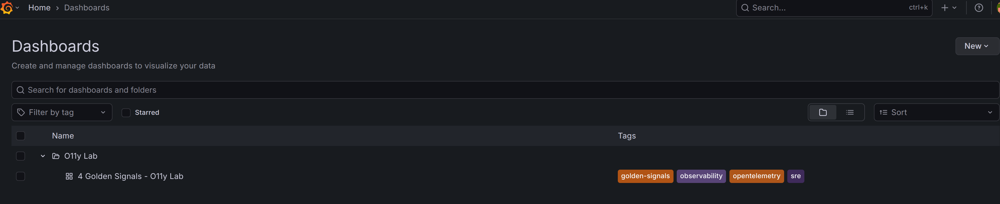
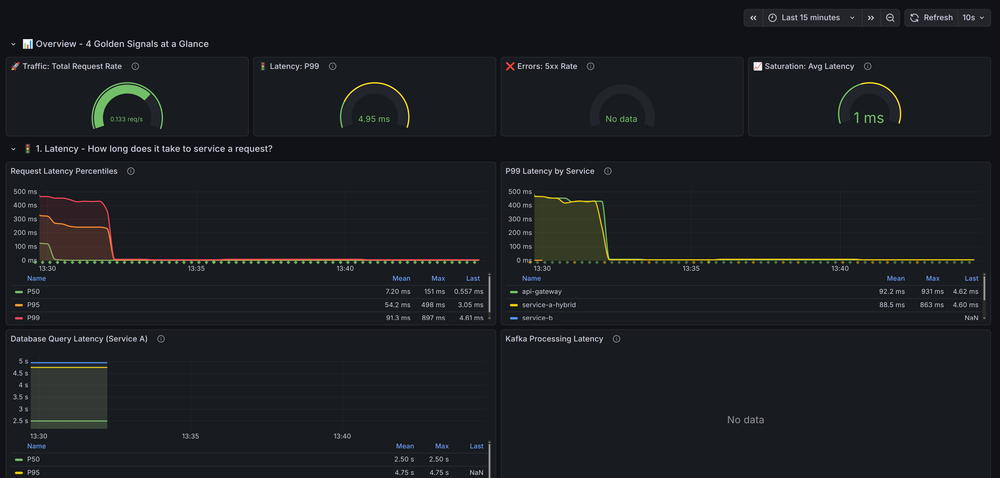
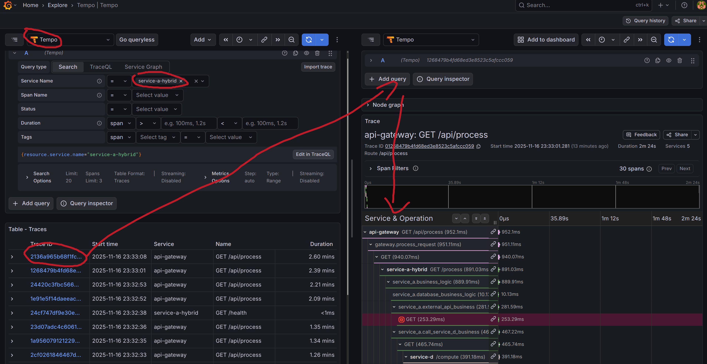
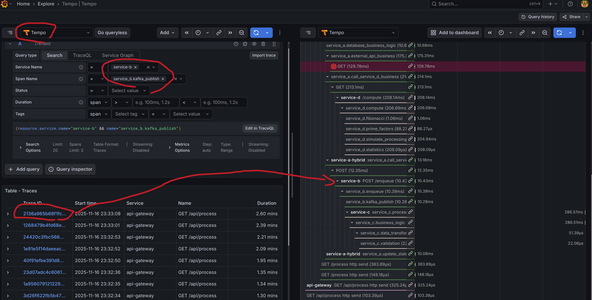

author: 雷N
summary: OpenTelemetry 可觀測性實驗室完整教學
id: o11y-lab-tutorial
categories: observability,opentelemetry,docker
environments: Web
status: Published
feedback link: https://github.com/tedmax100/o11y_lab_for_dummies/issues/new?template=codelabs-feedback.md&labels=codelabs,documentation

# OpenTelemetry 可觀測性實驗室教學

## 課程簡介

Duration: 2

### 你將學到什麼

在這個實驗室中，你將學習如何：

- 搭建完整的可觀測性環境（Grafana + Prometheus + Loki + Tempo）
- 使用 Docker Compose 快速部署微服務架構
- 理解 Python 自動埋點（Auto Instrumentation）
- 實踐 Python 手動埋點（Manual Instrumentation）
- 使用 K6 進行多種負載測試（煙霧測試、負載測試、壓力測試、尖峰測試）
- 使用 Pumba 進行混沌工程（延遲注入）
- 在 Grafana 中關聯 Logs、Metrics、Traces

### 前置要求

- 基本的 Linux 命令列知識
- 理解 Docker 基礎概念
- Python 或 Go 程式設計基礎

### 實驗環境

- Ubuntu/MacOS/Windows (WSL2)
- 至少 8GB RAM
- 20GB 可用磁碟空間

---

## 環境準備 - Docker & Docker Compose

Duration: 10

### 安裝 Docker

#### Linux (Ubuntu/Debian)

```bash
# 更新軟體套件索引
sudo apt-get update

# 安裝相依套件
sudo apt-get install -y \
    ca-certificates \
    curl \
    gnupg \
    lsb-release

# 新增 Docker 官方 GPG key
sudo mkdir -p /etc/apt/keyrings
curl -fsSL https://download.docker.com/linux/ubuntu/gpg | sudo gpg --dearmor -o /etc/apt/keyrings/docker.gpg

# 設定儲存庫
echo \
  "deb [arch=$(dpkg --print-architecture) signed-by=/etc/apt/keyrings/docker.gpg] https://download.docker.com/linux/ubuntu \
  $(lsb_release -cs) stable" | sudo tee /etc/apt/sources.list.d/docker.list > /dev/null

# 安裝 Docker Engine
sudo apt-get update
sudo apt-get install -y docker-ce docker-ce-cli containerd.io docker-buildx-plugin docker-compose-plugin

# 將目前使用者加入 docker 群組
sudo usermod -aG docker $USER
newgrp docker
```

#### MacOS

```bash
# 使用 Homebrew 安裝
brew install --cask docker

# 或者直接下載 Docker Desktop
# https://www.docker.com/products/docker-desktop/
```

#### Windows

下載並安裝 Docker Desktop for Windows:
https://www.docker.com/products/docker-desktop/

### 驗證安裝

```bash
# 檢查 Docker 版本
docker --version
# 應顯示: Docker version 24.0.0 或更高

# 檢查 Docker Compose
docker compose version
# 應顯示: Docker Compose version v2.20.0 或更高

# 測試 Docker 運作
docker run hello-world
```

Positive
: 如果看到 "Hello from Docker!" 訊息，表示 Docker 安裝成功！

---

## 環境準備 - Python & Go

Duration: 8

### 安裝 Python 3.11+

#### Linux (Ubuntu/Debian)

```bash
# 新增 deadsnakes PPA
sudo add-apt-repository ppa:deadsnakes/ppa
sudo apt-get update

# 安裝 Python 3.11
sudo apt-get install -y python3.11 python3.11-venv python3.11-dev

# 安裝 pip
curl -sS https://bootstrap.pypa.io/get-pip.py | python3.11

# 驗證安裝
python3.11 --version
pip3.11 --version
```

#### MacOS

```bash
brew install python@3.11

# 驗證
python3.11 --version
```

#### Windows

下載並安裝 Python 3.11:
https://www.python.org/downloads/

### 安裝 Go 1.21+

#### Linux

```bash
# 下載 Go
wget https://go.dev/dl/go1.21.5.linux-amd64.tar.gz

# 解壓縮到 /usr/local
sudo rm -rf /usr/local/go
sudo tar -C /usr/local -xzf go1.21.5.linux-amd64.tar.gz

# 新增到 PATH (加入 ~/.bashrc 或 ~/.zshrc)
echo 'export PATH=$PATH:/usr/local/go/bin' >> ~/.bashrc
source ~/.bashrc

# 驗證
go version
```

#### MacOS

```bash
brew install go@1.21

# 驗證
go version
```

#### Windows

下載並安裝 Go:
https://go.dev/dl/

### 安裝 K6

K6 是一個現代化的負載測試工具。

#### Linux

```bash
sudo gpg -k
sudo gpg --no-default-keyring --keyring /usr/share/keyrings/k6-archive-keyring.gpg --keyserver hkp://keyserver.ubuntu.com:80 --recv-keys C5AD17C747E3415A3642D57D77C6C491D6AC1D69
echo "deb [signed-by=/usr/share/keyrings/k6-archive-keyring.gpg] https://dl.k6.io/deb stable main" | sudo tee /etc/apt/sources.list.d/k6.list
sudo apt-get update
sudo apt-get install k6

# 驗證
k6 version
```

#### MacOS

```bash
brew install k6

# 驗證
k6 version
```

#### 使用 Docker (跨平台)

```bash
docker pull grafana/k6:latest
docker run --rm -i grafana/k6 version
```

Positive
: 所有工具安裝完成！現在可以開始實驗了。

---

## 複製專案並啟動環境

Duration: 5

### 取得專案程式碼

```bash
# 複製儲存庫
git clone https://github.com/yourusername/o11y_lab_for_dummies.git
cd o11y_lab_for_dummies

# 查看專案結構
ls -la
```

### 啟動所有服務

```bash
# 使用 Docker Compose 啟動
docker compose up -d

# 查看服務狀態
docker compose ps

# 查看日誌（選用）
docker compose logs -f
```

你應該會看到以下服務啟動：

- **api-gateway**: Python FastAPI 閘道器
- **service-a**: Python FastAPI 服務（自動埋點）
- **service-b**: Go 服務（手動埋點）
- **service-c**: Go 服務（手動埋點）
- **service-d**: Python Flask 服務（自動埋點）
- **grafana**: 視覺化平台
- **prometheus**: Metrics 儲存
- **loki**: 日誌儲存
- **tempo**: Trace 儲存
- **otel-collector**: OpenTelemetry 收集器
- **postgres**: 資料庫
- **kafka**: 訊息佇列


### Overall Architecture

```

┌─────────────┐

│   Client    │

└──────┬──────┘

       │ HTTP

       ▼

┌─────────────────────────────────────────────────────────────┐

│                      API Gateway                             │

│                    (Python/FastAPI)                          │

│                 Auto Instrumentation                         │

└──────┬──────────────────────────────────────────────────────┘

       │

       ▼

┌─────────────────────────────────────────────────────────────┐

│                      Service A                               │

│                    (Python/FastAPI)                          │

│                 Auto Instrumentation                         │

│  ┌──────────┐  ┌──────────┐  ┌──────────┐  ┌──────────┐   │

│  │PostgreSQL│  │Service D │  │Service B │  │3rd Party │   │

│  │  Query   │  │   Call   │  │   Call   │  │API Call  │   │

│  └──────────┘  └──────────┘  └──────────┘  └──────────┘   │

└──────┬────────────────┬────────────────┬─────────────────────┘

       │                │                │

       ▼                ▼                ▼

  ┌─────────┐    ┌──────────┐    ┌──────────┐

  │PostgreSQL   │ Service D│    │Service B │

  │         │    │ (Python/ │    │(Go/Gin)  │

  │         │    │  Flask)  │    │Manual    │

  └─────────┘    │   Auto   │    │Instrument│

                 │Instrument│    └────┬─────┘

                 └──────────┘         │

                                      ▼

                                 ┌─────────┐

                                 │  Kafka  │

                                 │  Queue  │

                                 └────┬────┘

                                      │

                                      ▼

                                 ┌──────────┐

                                 │Service C │

                                 │(Go/Gin)  │

                                 │Manual    │

                                 │Instrument│

                                 └──────────┘

```

### Observability Architecture

```

┌─────────────────────────────────────────────────────────────┐

│                    Application Services                      │

│  API Gateway │ Service A │ Service B │ Service C │ Service D│

└──────────────────────┬──────────────────────────────────────┘

                       │ OTLP (gRPC/HTTP)

                       │ - Traces

                       │ - Metrics

                       │ - Logs

                       ▼

┌─────────────────────────────────────────────────────────────┐

│            OpenTelemetry Collector                           │

│  ┌──────────┐  ┌───────────┐  ┌──────────┐                │

│  │Receivers │→ │Processors │→ │Exporters │                │

│  └──────────┘  └───────────┘  └──────────┘                │

│       │              │               │                       │

│     OTLP          Batch          OTLP/Prom/Loki            │

└───────┼──────────────┼───────────────┼──────────────────────┘

        │              │               │

        ▼              ▼               ▼

  ┌─────────┐   ┌───────────┐   ┌─────────┐

  │  Tempo  │   │Prometheus │   │  Loki   │

  │(Traces) │   │ (Metrics) │   │ (Logs)  │

  └────┬────┘   └─────┬─────┘   └────┬────┘

       │              │               │

       └──────────────┼───────────────┘

                      ▼

              ┌──────────────┐

              │   Grafana    │

              │  Dashboard   │

              └──────────────┘

```


### 等待服務就緒

```bash
# 檢查所有容器是否健康
docker compose ps

# 等待約 30-60 秒讓所有服務啟動完成
```

Positive
: 所有服務啟動後，我們就可以存取 Grafana 了！

---

## 存取 Grafana 平台

Duration: 10

### 登入 Grafana

1. 開啟瀏覽器存取: **http://localhost:3000**
2. 使用預設憑證登入:

   - **使用者名稱**: `admin`
   - **密碼**: `admin`
3. 首次登入會提示修改密碼，可以選擇跳過（Skip）

### Grafana 介面介紹

登入後你會看到 Grafana 主介面：


#### 左側選單列

- **Home**: 首頁
- **Dashboards**: 儀表板清單
- **Explore**: 資料探索介面（我們主要使用這個）
- **Alerting**: 告警配置
- **Configuration**: 配置選項

### 查看資料來源

1. 點擊左側選單的齒輪圖示 (Configuration)
2. 選擇 **Data sources**
3. 你應該會看到以下資料來源已配置:
   - **Prometheus**: Metrics 資料
   - **Loki**: 日誌資料
   - **Tempo**: Trace 資料

### 探索預先配置的 Dashboard

1. 點擊左側選單的 Dashboard 圖示
2. 你會看到預先配置的儀表板:
   - **OpenTelemetry Overview**: 整體概覽
   - **Service Performance**: 服務效能監控
   - **Distributed Tracing**: 分散式追蹤

儀表板列表:

Four Golden Signal 儀表板:


Positive
: Grafana 平台已經準備好了！接下來我們將使用 K6 生成流量。

---

## 使用 K6 進行負載測試

Duration: 15

### K6 測試腳本介紹

專案中已經包含了四種不同的 K6 測試腳本，分別用於不同的測試場景：

#### 1. 煙霧測試 (Smoke Test) - `smoke-test.js`

- **目的**: 驗證系統基本功能
- **虛擬用戶**: 1 個
- **持續時間**: 1 分鐘
- **使用時機**: 部署後快速驗證、CI/CD 流程

#### 2. 負載測試 (Load Test) - `load-test.js`

- **目的**: 測試系統在預期負載下的性能
- **虛擬用戶**: 5 → 20 → 50（多階段）
- **持續時間**: 約 3.5 分鐘
- **使用時機**: 性能基準測試、容量規劃

#### 3. 壓力測試 (Stress Test) - `stress-test.js`

- **目的**: 找出系統性能瓶頸和極限
- **虛擬用戶**: 10 → 50 → 100 → 200（逐步增加）
- **持續時間**: 約 6 分鐘
- **使用時機**: 尋找系統瓶頸、驗證降級機制

#### 4. 尖峰測試 (Spike Test) - `spike-test.js`

- **目的**: 測試系統應對突發流量的能力
- **虛擬用戶**: 10 → 100 → 10 → 150（快速變化）
- **持續時間**: 約 4 分鐘
- **使用時機**: 測試自動擴展、驗證系統彈性

### 查看測試腳本

```bash
# 查看所有可用的測試腳本
ls -lh k6/

# 查看負載測試腳本內容
cat k6/load-test.js

# 查看 README 文檔
cat k6/README.md
```

### 執行 K6 測試

#### 方式一：使用 Makefile（推薦，無需安裝 K6）

專案已整合 K6 到 Makefile，使用 Docker 執行，**完全不需要本地安裝 K6**！

```bash
# 查看所有 K6 測試命令和說明
make k6-help

# 1. 煙霧測試 - 快速驗證系統功能（1分鐘）
make k6-smoke

# 2. 負載測試 - 測試正常負載下的性能（3.5分鐘）
make k6-load

# 3. 尖峰測試 - 測試突發流量（4分鐘）
make k6-spike

# 4. 壓力測試 - 找出系統極限（6分鐘，可能影響系統穩定性）
make k6-stress

# 清理測試結果
make k6-clean
```

**優點**：

- ✅ 無需本地安裝 K6，使用 Docker 執行
- ✅ 命令簡單易記
- ✅ 自動處理網路和檔案掛載
- ✅ 環境一致性高

#### 方式二：直接使用 K6（需先安裝）

如果你已經安裝了 K6：

```bash
# 1. 煙霧測試
k6 run k6/smoke-test.js

# 2. 負載測試
k6 run k6/load-test.js

# 3. 尖峰測試
k6 run k6/spike-test.js

# 4. 壓力測試
k6 run k6/stress-test.js
```

#### 方式三：使用 Docker 手動執行

```bash
# 使用 Docker 運行負載測試
docker run --rm -i --network=host \
  -v $(pwd)/k6:/scripts \
  grafana/k6:latest run /scripts/load-test.js
```

### 測試結果解讀

執行測試後，你會在終端看到詳細的結果報告：

```
📊 測試結果摘要
==================================================

  █ THRESHOLDS 

    http_req_duration
    ✓ 'p(95)<2000' p(95)=969.75ms

      {name:process}
      ✓ 'p(99)<5000' p(99)=1.2s

    http_req_failed
    ✓ 'rate<0.01' rate=0.00%

    process_success_rate
    ✓ 'rate>0.99' rate=100.00%


  █ TOTAL RESULTS 

    checks_total.......: 8275   43.39831/s
    checks_succeeded...: 96.70% 8002 out of 8275
    checks_failed......: 3.29%  273 out of 8275

    ✓ 狀態碼是 200
    ✓ 回應包含 status
    ✓ 回應包含 data
    ✓ 回應時間 < 5秒
    ✓ Stats 狀態碼是 200
    ✗ Stats 回應包含 service
      ↳  0% — ✓ 0 / ✗ 273
    ✓ Stats 回應包含統計數據
    ✓ Info 狀態碼是 200
    ✓ Info 回應包含 service
    ✓ API Gateway 健康檢查通過
    ✓ Service A 健康檢查通過

    CUSTOM
    process_duration...............: avg=676.445165 min=291      med=654      max=1538  p(90)=947      p(95)=1039  
    process_success_rate...........: 100.00% 1541 out of 1541

    HTTP
    http_req_duration..............: avg=402.79ms   min=603.81µs med=468.43ms max=1.53s p(90)=862.94ms p(95)=969.75ms
      { expected_response:true }...: avg=402.79ms   min=603.81µs med=468.43ms max=1.53s p(90)=862.94ms p(95)=969.75ms
      { name:process }.............: avg=676.31ms   min=291.57ms med=653.74ms max=1.53s p(90)=947.12ms p(95)=1.03s   
    http_req_failed................: 0.00%   0 out of 2623
    http_reqs......................: 2623    13.756347/s

    EXECUTION
    iteration_duration.............: avg=2.67s      min=1.38s    med=2.67s    max=4.43s p(90)=3.49s    p(95)=3.62s   
    iterations.....................: 1541    8.081788/s
    vus............................: 1       min=1            max=50
    vus_max........................: 50      min=50           max=50

    NETWORK
    data_received..................: 1.8 MB  9.2 kB/s
    data_sent......................: 208 kB  1.1 kB/s


running (3m10.7s), 00/50 VUs, 1541 complete and 0 interrupted iterations
default ✓ [ 100% ] 00/50 VUs  3m10s

✅ Load test complete! Check output above for results.
```

**關鍵指標說明**：

- `http_req_duration`: 請求響應時間
  - `avg`: 平均響應時間
  - `p(95)`: 95% 的請求在此時間內完成
  - `p(99)`: 99% 的請求在此時間內完成
- `http_req_failed`: 請求失敗率
- `checks`: 檢查項目通過率

### 在 Grafana 中即時觀察測試影響

在執行 K6 測試時，建議同時在 Grafana 中觀察系統指標：

#### 1. 觀察 Metrics（指標）

1. 開啟 Grafana: http://localhost:3000
2. 點擊左側的 **Explore** 圖示
3. 選擇資料來源: **Prometheus**
4. 輸入以下查詢並點擊 **Run query**:

   ```promql
   # 請求速率
   rate(http_server_requests_seconds_count[1m])

   # 平均響應時間
   rate(http_server_requests_seconds_sum[1m]) / rate(http_server_requests_seconds_count[1m])

   # 錯誤率
   rate(http_server_requests_seconds_count{status=~"5.."}[1m])
   ```

#### 2. 觀察 Traces（追蹤）

1. 在 Grafana **Explore** 中
2. 切換資料來源為: **Tempo**
3. 選擇 **Search** 標籤
4. 設定搜尋條件:
   - Service Name: `api-gateway` 或 `service-a-hybrid`
   - 時間範圍: 最近 15 分鐘
5. 點擊任一 Trace 查看詳細的分散式追蹤

你會看到：

- 完整的請求流程（Gateway → Service A → Service D/B）
- 每個服務的處理時間
- 資料庫查詢耗時
- 外部 API 調用時間

#### 3. 觀察 Logs（日誌）

1. 在 Grafana **Explore** 中
2. 切換資料來源為: **Loki**
3. 使用以下查詢:

   ```logql
   # 查看所有服務日誌
   {container_name=~"api-gateway|service-a|service-b|service-d"}

   # 只看錯誤日誌
   {container_name=~"api-gateway|service-a"} |= "ERROR"

   # 根據 trace_id 查詢（從 Trace 中複製）
   {container_name=~".*"} |= "your-trace-id-here"
   ```

### 實戰演練：完整測試流程

建議按照以下順序進行測試：

#### Step 1: 煙霧測試（1 分鐘）

```bash
# 使用 Makefile（推薦）
make k6-smoke

# 或使用 K6 直接執行
k6 run k6/smoke-test.js
```

✅ 確認：所有檢查都通過，失敗率 < 1%

#### Step 2: 負載測試（3.5 分鐘）

```bash
# 終端 1: 監控即時日誌
docker compose logs -f api-gateway service-a

# 終端 2: 執行負載測試（使用 Makefile）
make k6-load

# 或使用 K6 直接執行
k6 run k6/load-test.js
```

✅ 確認：在 Grafana 中觀察到請求速率上升

#### Step 3: 分析測試結果

1. 在 Grafana **Explore** (Tempo) 中找到測試期間的 traces
2. 點擊一個 trace，查看完整的調用鏈路
3. 切換到 **Logs** 標籤，查看相關日誌
4. 注意 trace_id 如何關聯 logs 和 traces

#### Step 4: 尖峰測試（選用，4 分鐘）

```bash
# 使用 Makefile
make k6-spike

# 或使用 K6 直接執行
k6 run k6/spike-test.js
```

✅ 觀察：系統在流量突增時的表現和恢復能力

### 測試建議與最佳實踐

Positive
: **提示**：建議測試順序為 smoke → load → spike → stress，避免一開始就執行壓力測試導致系統不穩定。

Negative
: **警告**：壓力測試可能會導致系統資源耗盡或服務崩潰，建議在獨立環境中執行。

### 進階用法

#### 自訂測試參數

```bash
# 使用環境變數指定不同的服務地址
k6 run -e BASE_URL=http://your-gateway:8080 k6/load-test.js

# 輸出結果到 JSON 檔案
k6 run --out json=results.json k6/load-test.js

# 在背景執行持續負載（用於混沌測試）
k6 run --duration 10m k6/load-test.js &
```

#### 結合混沌測試

```bash
# 終端 1: 執行持續負載
k6 run --duration 10m k6/load-test.js

# 終端 2: 注入網路延遲
make chaos-network-delay

# 觀察系統在故障情況下的表現
```

Positive
: 完成測試後，檢查 k6 目錄中生成的 JSON 報告檔案，可用於深入分析和歷史對比。

---

## 混沌工程入門 - Pumba 基礎

Duration: 8

### 什麼是混沌工程？

混沌工程是一種透過**主動注入故障**來測試系統韌性的實踐方法。在生產環境中，服務可能遇到：

- 🌐 網路延遲或斷線
- 💥 服務突然崩潰
- 📉 資源不足（CPU、記憶體）
- 🔌 依賴服務失效

透過混沌測試，我們可以：

1. 驗證系統的容錯能力
2. 發現隱藏的單點故障
3. 測試監控和告警是否有效
4. 提升團隊的應變能力

### Pumba 簡介

Pumba 是一個專為 Docker 容器設計的混沌工程工具，支援：

- **網路混沌**：延遲、丟包、頻寬限制
- **容器混沌**：隨機終止、暫停、資源限制
- **靈活控制**：指定持續時間、目標容器、故障強度

**最棒的是**：我們已經在 Makefile 中整合了 Pumba，無需安裝！

### 查看可用的混沌測試命令

```bash
# 查看所有混沌測試命令
make chaos-help
```

你會看到：

- 基礎混沌測試（網路延遲、丟包、容器終止）
- 服務特定測試（針對單一服務）
- 複雜場景（模擬真實故障）

Positive
: **提示**：所有混沌測試都使用 Docker 運行 Pumba，不需要額外安裝任何工具！

### 第一個混沌測試 - 網路延遲

讓我們從最簡單的測試開始：給 Service A 添加 1 秒的網路延遲。

```bash
# 給 Service A 添加 1000ms 延遲，持續 3 分鐘
make chaos-delay-service-a
```

你會看到：

```
🐌 給 Service A 添加 1000ms 延遲，持續 3 分鐘
✅ Service A 延遲已應用
```

### 在 Grafana 中觀察影響

現在混沌測試正在運行，讓我們在 Grafana 中觀察影響：

1. **同時生成測試流量**：

   ```bash
   k6 run k6/load-test.js
   ```
2. **在 Grafana 中查看延遲指標**：

   - 打開 Grafana: http://localhost:3000
   - 進入 Explore
   - 選擇 Prometheus 數據源
   - 執行查詢：

   ```promql
   histogram_quantile(0.95,
     rate(http_server_duration_milliseconds_bucket{service_name="service-a"}[1m])
   )
   ```
3. **觀察結果**：

   - 正常情況：P95 延遲約 50-100ms
   - 混沌注入後：P95 延遲上升到 1000ms 以上


### 停止混沌測試

3 分鐘後，測試會自動停止。或者手動停止：

```bash
# 停止所有混沌測試
make chaos-stop

# 清理 Pumba 容器
make chaos-clean
```

### 查看混沌測試狀態

```bash
# 查看當前運行的混沌測試
make chaos-status
```

Negative
: **重要提醒**：混沌測試會真實影響服務效能。實驗完成後記得停止測試，避免影響後續步驟！

---

## 混沌工程進階 - 完整混沌測試指南

Duration: 20

現在你已經了解基礎，讓我們探索更多混沌測試場景。本章節將按難度循序漸進介紹。

### Level 1：基礎網路混沌 ⭐

這些測試適合初學者，幫助你理解網路問題對系統的影響。

#### 1.1 網路延遲（所有服務）

```bash
# 給所有應用服務添加 500ms 延遲，持續 5 分鐘
make chaos-network-delay
```

**適用場景**：

- 模擬跨區域網路
- 測試超時設定是否合理
- 驗證用戶體驗降級策略

**觀察重點**：

- 整體系統的回應時間
- 是否有服務因超時而失敗
- Grafana 中的 Trace 鏈路延遲

#### 1.2 網路丟包

```bash
# 給所有服務添加 20% 丟包率，持續 5 分鐘
make chaos-network-loss
```

**適用場景**：

- 模擬不穩定的網路環境
- 測試重試機制
- 驗證錯誤處理

**觀察重點**：

- 錯誤率是否上升
- 重試邏輯是否生效
- Logs 中的錯誤訊息

#### 1.3 網路包損壞

```bash
# 給所有服務添加 10% 包損壞率，持續 5 分鐘
make chaos-network-corrupt
```

**適用場景**：

- 測試資料完整性驗證
- 模擬硬體故障
- 驗證協定的錯誤檢測能力

Positive
: **小技巧**：可以同時在另一個終端視窗運行 `make chaos-status` 來即時監控混沌測試狀態。

### Level 2：服務特定混沌 ⭐⭐

針對單一服務進行測試，更精確地模擬特定故障。

#### 2.1 測試單一服務的韌性

```bash
# 給 Service B 添加 30% 丟包率
make chaos-loss-service-b
```

**實驗步驟**：

1. 啟動混沌測試
2. 運行 K6: `k6 run k6/load-test.js`
3. 在 Grafana 中查看：
   - Service A 是否能正常處理 Service B 的故障？
   - 錯誤是否被正確記錄？
   - Trace 中是否顯示失敗的 Span？

#### 2.2 資料庫混沌測試

```bash
# 對 PostgreSQL 進行壓力測試
make chaos-stress-postgres
```

**觀察重點**：

- 資料庫查詢延遲
- 連接池是否耗盡
- 應用是否有快取機制來減輕影響

#### 2.3 Message Queue 混沌

```bash
# 暫停 Kafka 容器 30 秒
make chaos-pause-kafka
```

**觀察重點**：

- Service B 和 Service C 如何處理消息發送失敗
- 消息是否會丟失
- 恢復後是否能正常消費

### Level 3：容器生命週期混沌 ⭐⭐⭐

測試服務在突然終止和重啟時的行為。

#### 3.1 隨機殺死服務

```bash
# 每 30 秒隨機殺死一個應用服務
make chaos-kill-random
```

**這個測試會**：

- 隨機選擇一個服務（api-gateway 或 service-a/b/c/d）
- 發送 SIGKILL 信號終止容器
- Docker Compose 會自動重啟容器

**實驗步驟**：

1. 啟動混沌測試
2. 在另一個終端持續運行 K6
3. 觀察 Grafana 中的：

   - 錯誤率變化
   - 服務重啟的 Trace 缺口
   - Metrics 的斷點
4. 運行 2-3 分鐘後停止：

   ```bash
   make chaos-stop
   ```

#### 3.2 殺死 API Gateway

```bash
# 一次性殺死 API Gateway
make chaos-kill-gateway
```

**觀察重點**：

- 重啟需要多久？
- 期間有多少請求失敗？
- 負載均衡器（如果有）如何處理？

Negative
: **注意**：`chaos-kill-random` 會持續運行，記得在實驗結束後執行 `make chaos-stop` 停止！

### Level 4：複雜真實場景 ⭐⭐⭐⭐

模擬多個故障同時發生的複雜情況。

#### 4.1 微服務鏈路故障

這個場景模擬多個服務同時出現不同問題：

```bash
# 啟動複雜場景
make chaos-microservice-chain
```

**這個命令會同時**：

- Service A：網路延遲 800ms
- Service B：15% 丟包
- Service C：CPU 壓力

**實驗步驟**：

1. **啟動混沌測試**
2. **持續生成流量**：

   ```bash
   k6 run k6/load-test.js
   ```
3. **在 Grafana 中觀察鏈路**：

   - 打開 Tempo（Traces）
   - 查找完整的請求鏈路
   - 觀察哪個服務成為瓶頸
4. **分析 Metrics**：

   ```promql
   # 各服務的錯誤率
   rate(http_server_requests_total{status_code=~"5.."}[1m])

   # 各服務的延遲
   histogram_quantile(0.95,
     rate(http_server_duration_milliseconds_bucket[1m]))
   ```
5. **查看 Logs**：

   - 在 Grafana Loki 中搜尋錯誤
   - 點擊 Trace ID 關聯查看
6. **5 分鐘後停止**：

   ```bash
   make chaos-stop
   ```

#### 4.2 資料庫中斷場景

```bash
# 模擬資料庫中斷（2000ms 延遲）
make chaos-database-outage
```

**觀察重點**：

- Service A 的資料庫查詢超時
- 連接池是否耗盡
- 應用如何處理資料庫慢查詢

#### 4.3 網路分區

```bash
# 模擬 Service A 和 Service B 之間網路分區
make chaos-network-partition
```

**這個測試會**：

- Service A 和 Service B 各有 90% 丟包
- 模擬兩個服務幾乎無法通訊

**觀察重點**：

- 系統如何降級
- 是否有 Circuit Breaker 觸發
- 錯誤處理和 Fallback 機制

### Level 5：自訂混沌測試 ⭐⭐⭐⭐⭐

你也可以直接使用 Pumba Docker 命令進行更靈活的測試：

```bash
# 對特定服務添加複雜網路條件
docker run -d --name my-chaos-test \
  -v /var/run/docker.sock:/var/run/docker.sock \
  gaiaadm/pumba:latest \
  netem --duration 3m \
  --tc-image ghcr.io/alexei-led/pumba-alpine-nettools:latest \
  delay --time 1000 --jitter 300 --distribution normal \
  service-a
```

**自訂參數**：

- `--time`: 延遲時間（毫秒）
- `--jitter`: 抖動範圍
- `--distribution`: 分佈類型（normal, pareto, paretonormal）
- `--correlation`: 相關性百分比

### 混沌測試最佳實踐

Positive
: **循序漸進**：① 先從單一、簡單的故障開始；② 逐步增加複雜度；③ 在生產環境前先在測試環境驗證；④ 建立回滾計畫。

Positive
: **觀察與分析**：① 使用 Grafana 的三大支柱（Logs、Metrics、Traces）；② 記錄每次實驗的發現；③ 驗證告警是否正常觸發；④ 測量恢復時間（MTTR）。

Positive
: **安全第一**：① 永遠先在非生產環境測試；② 設定明確的測試時間窗口；③ 確保可以快速停止測試；④ 通知團隊成員正在進行混沌測試。

### 混沌測試 Checklist

實驗前：

- [ ] 確認所有服務正常運行 (`make status`)
- [ ] Grafana 可以正常存取
- [ ] K6 已安裝並可以運行
- [ ] 了解如何停止測試 (`make chaos-stop`)

實驗中：

- [ ] 在 Grafana 中即時觀察
- [ ] 記錄觀察到的現象
- [ ] 截圖保存重要發現

實驗後：

- [ ] 停止所有混沌測試 (`make chaos-stop`)
- [ ] 清理 Pumba 容器 (`make chaos-clean`)
- [ ] 驗證服務恢復正常
- [ ] 總結學習重點

---

## Python Auto Instrumentation 詳解

Duration: 15

### 什麼是自動埋點？

自動埋點（Auto Instrumentation）是指**無需修改程式碼**，透過 OpenTelemetry Agent 或 SDK 自動捕獲遙測資料。

### Service-A 的自動埋點配置

查看 Service-A 的 Dockerfile：

```bash
cat services/service-a/Dockerfile
```

你會看到類似這樣的配置：

```dockerfile
FROM python:3.11-slim

# 安裝相依套件
COPY requirements.txt .
RUN pip install -r requirements.txt

# 安裝 OpenTelemetry 自動埋點套件
RUN pip install opentelemetry-distro \
                opentelemetry-exporter-otlp

# 自動檢測並安裝相關函式庫的埋點
RUN opentelemetry-bootstrap -a install

COPY . /app
WORKDIR /app

# 使用 opentelemetry-instrument 啟動應用程式
CMD ["opentelemetry-instrument", "uvicorn", "main:app", "--host", "0.0.0.0", "--port", "8001"]
```

### 關鍵元件說明

#### 1. `opentelemetry-distro`

OpenTelemetry 的完整發行版，包含所有核心功能。

#### 2. `opentelemetry-bootstrap`

自動檢測應用程式相依的函式庫，並安裝對應的埋點套件：

- FastAPI → `opentelemetry-instrumentation-fastapi`
- Requests → `opentelemetry-instrumentation-requests`
- SQLAlchemy → `opentelemetry-instrumentation-sqlalchemy`

#### 3. `opentelemetry-instrument`

啟動時的包裝器，自動啟用所有埋點。

### 環境變數配置

在 `docker-compose.yaml` 中，Service-A 配置了以下環境變數：

```yaml
environment:
  OTEL_SERVICE_NAME: service-a
  OTEL_TRACES_EXPORTER: otlp
  OTEL_METRICS_EXPORTER: otlp
  OTEL_LOGS_EXPORTER: otlp
  OTEL_EXPORTER_OTLP_ENDPOINT: http://otel-collector:4317
  OTEL_EXPORTER_OTLP_PROTOCOL: grpc
  OTEL_RESOURCE_ATTRIBUTES: service.name=service-a,service.version=1.0.0
```

### 查看自動生成的 Traces

1. 觸發一個請求:

   ```bash
   curl http://localhost:8080/api/process
   ```
2. 在 Grafana 中:

   - 開啟 **Explore**
   - 選擇資料來源: **Tempo**
   - 選擇 **Service**: `service-a-hybrid`
   - 點擊 **Run query**
3. 點擊任意 trace，你會看到自動生成的 spans:

   - HTTP 請求 span
   - 資料庫查詢 span
   - 下游服務呼叫 span



### 自動埋點的優勢

✅ **零程式碼侵入**: 不需要修改業務程式碼
✅ **快速啟用**: 幾分鐘內完成配置
✅ **覆蓋廣泛**: 自動支援常見框架和函式庫
✅ **標準化**: 遵循 OpenTelemetry 規範

### 自動埋點的局限

❌ **缺乏業務情境**: 無法捕獲業務特定的指標
❌ **精細度有限**: 無法自訂 span 屬性
❌ **效能開銷**: 可能捕獲不必要的資訊

Positive
: 自動埋點適合快速開始和通用場景，但複雜業務需要手動埋點！

---

## Python Manual Instrumentation 詳解

Duration: 15

### 為什麼需要手動埋點？

手動埋點允許你：

- 新增業務特定的 metrics 和 traces
- 自訂 span 屬性和事件
- 最佳化效能（只記錄需要的資料）
- 新增業務語義

### Service-D 的手動埋點範例

查看 Service-D 的程式碼：

```bash
cat services/service-d/app.py
```

#### 1. 初始化 OpenTelemetry

```python
from opentelemetry import trace, metrics
from opentelemetry.sdk.trace import TracerProvider
from opentelemetry.sdk.trace.export import BatchSpanProcessor
from opentelemetry.exporter.otlp.proto.grpc.trace_exporter import OTLPSpanExporter
from opentelemetry.sdk.resources import Resource
from opentelemetry.sdk.metrics import MeterProvider
from opentelemetry.sdk.metrics.export import PeriodicExportingMetricReader
from opentelemetry.exporter.otlp.proto.grpc.metric_exporter import OTLPMetricExporter

# 定義服務資源
resource = Resource.create({
    "service.name": "service-d",
    "service.version": "1.0.0",
    "deployment.environment": "production"
})

# 配置 Trace Provider
trace_provider = TracerProvider(resource=resource)
span_processor = BatchSpanProcessor(
    OTLPSpanExporter(endpoint="http://otel-collector:4317")
)
trace_provider.add_span_processor(span_processor)
trace.set_tracer_provider(trace_provider)

# 配置 Metrics Provider
metric_reader = PeriodicExportingMetricReader(
    OTLPMetricExporter(endpoint="http://otel-collector:4317")
)
meter_provider = MeterProvider(
    resource=resource,
    metric_readers=[metric_reader]
)
metrics.set_meter_provider(meter_provider)

# 取得 tracer 和 meter
tracer = trace.get_tracer(__name__)
meter = metrics.get_meter(__name__)
```

#### 2. 建立自訂 Span

```python
from flask import Flask, request
from opentelemetry import trace

app = Flask(__name__)
tracer = trace.get_tracer(__name__)

@app.route('/process')
def process():
    # 建立一個自訂 span
    with tracer.start_as_current_span("business_logic") as span:
        # 新增自訂屬性
        span.set_attribute("user.id", request.headers.get("X-User-ID", "anonymous"))
        span.set_attribute("request.size", len(request.data))

        # 新增事件
        span.add_event("Processing started", {
            "items": 10,
            "priority": "high"
        })

        # 業務邏輯
        result = do_business_logic()

        # 新增結果屬性
        span.set_attribute("result.count", len(result))

        return result
```

#### 3. 建立自訂 Metrics

```python
from opentelemetry import metrics

meter = metrics.get_meter(__name__)

# 建立計數器
request_counter = meter.create_counter(
    name="business.requests.total",
    description="Total number of business requests",
    unit="1"
)

# 建立直方圖
processing_time = meter.create_histogram(
    name="business.processing.duration",
    description="Processing duration in milliseconds",
    unit="ms"
)

# 使用 metrics
@app.route('/process')
def process():
    start_time = time.time()

    # 增加計數器
    request_counter.add(1, {"endpoint": "/process", "method": "GET"})

    # 處理請求
    result = do_work()

    # 記錄處理時間
    duration = (time.time() - start_time) * 1000
    processing_time.record(duration, {"status": "success"})

    return result
```

#### 4. 結構化日誌與 Trace 關聯

```python
import logging
from opentelemetry import trace

# 配置 JSON 日誌
import json_log_formatter

formatter = json_log_formatter.JSONFormatter()
json_handler = logging.StreamHandler()
json_handler.setFormatter(formatter)

logger = logging.getLogger(__name__)
logger.addHandler(json_handler)
logger.setLevel(logging.INFO)

@app.route('/process')
def process():
    # 取得目前 span context
    span = trace.get_current_span()
    trace_id = format(span.get_span_context().trace_id, '032x')
    span_id = format(span.get_span_context().span_id, '016x')

    # 記錄包含 trace 資訊的日誌
    logger.info("Processing request", extra={
        "trace_id": trace_id,
        "span_id": span_id,
        "user_id": request.headers.get("X-User-ID"),
        "endpoint": "/process"
    })

    return result
```

### 在 Grafana 中查看手動埋點資料

#### 查看自訂 Span

1. Grafana → Explore → Tempo
2. 搜尋 service-d 的 traces
3. 你會看到自訂的 `business_logic` span
4. 點擊查看詳細屬性:
   - `user.id`
   - `request.size`
   - `result.count`

#### 查看自訂 Metrics

1. Grafana → Explore → Prometheus
2. 查詢:
   ```promql
   rate(business_requests_total[1m])
   ```
3. 或者:
   ```promql
   histogram_quantile(0.95,
     rate(business_processing_duration_bucket[1m])
   )
   ```

#### 關聯日誌

1. Grafana → Explore → Loki
2. 查詢:
   ```logql
   {service_name="service-d"} | json
   ```
3. 點擊任意日誌行的 trace_id，直接跳轉到對應的 trace



### 手動埋點最佳實踐

1. **有意義的 Span 名稱**: 使用業務術語，如 `checkout_cart` 而不是 `process`
2. **新增情境屬性**: 使用者ID、訂單ID、產品類型等
3. **記錄關鍵事件**: 支付開始、庫存檢查、第三方呼叫等
4. **控制基數**: 避免高基數屬性（如時間戳記、UUID）作為 metric 標籤
5. **效能考量**: 使用採樣、避免在熱路徑建立過多 span

Positive
: 手動埋點給你完全控制權，但需要更多程式碼和維護工作！

---

## 混合使用 Auto 和 Manual Instrumentation

Duration: 10

### 最佳實踐：結合兩者

在實際專案中，通常會**混合使用**自動埋點和手動埋點：

```python
# app.py
from opentelemetry.instrumentation.fastapi import FastAPIInstrumentor
from opentelemetry import trace
from fastapi import FastAPI

app = FastAPI()

# 1. 啟用自動埋點（框架層級）
FastAPIInstrumentor.instrument_app(app)

# 2. 取得 tracer 用於手動埋點（業務層級）
tracer = trace.get_tracer(__name__)

@app.get("/checkout")
async def checkout(cart_id: str):
    # 自動埋點已經建立了 HTTP span

    # 新增業務層級的 span
    with tracer.start_as_current_span("validate_cart") as span:
        span.set_attribute("cart.id", cart_id)
        cart = await validate_cart(cart_id)

    with tracer.start_as_current_span("calculate_total") as span:
        total = calculate_total(cart)
        span.set_attribute("cart.total", total)

    with tracer.start_as_current_span("process_payment") as span:
        span.set_attribute("payment.method", "credit_card")
        result = await process_payment(total)

    return result
```

### 在 Grafana 中查看混合埋點

生成的 trace 會顯示：

```
HTTP POST /checkout (auto)              [200ms]
├─ validate_cart (manual)               [50ms]
│  └─ SELECT FROM carts (auto)          [20ms]
├─ calculate_total (manual)             [30ms]
└─ process_payment (manual)             [120ms]
   └─ HTTP POST /api/charge (auto)      [100ms]
```

### 決策樹：何時使用哪種方式？

```
是否是標準框架/函式庫（HTTP、DB、訊息佇列）？
├─ 是 → 使用自動埋點
└─ 否 → 是否是業務核心邏輯？
   ├─ 是 → 使用手動埋點
   └─ 否 → 可能不需要埋點
```

Positive
: 自動埋點打基礎，手動埋點加深度！

---

## Grafana 進階功能：關聯 Logs-Traces-Metrics

Duration: 12

### Trace to Logs

在查看 trace 時，直接跳轉到相關日誌：

1. 在 Tempo 中開啟一個 trace
2. 點擊任意 span
3. 在右側面板找到 **Logs for this span**
4. 點擊後自動跳轉到 Loki，顯示該 span 的日誌

### Logs to Traces

從日誌跳轉到 trace：

1. 在 Loki 中查詢:
   ```logql
   {service_name="service-a"} | json
   ```
2. 在日誌行中找到 `trace_id` 欄位
3. 點擊 trace_id 旁的圖示，跳轉到 Tempo

### Metrics to Traces

從 metrics 告警定位到具體請求：

1. 在 Prometheus 中發現異常:
   ```promql
   rate(http_requests_total{status="500"}[1m]) > 0
   ```
2. 記下時間範圍和服務名稱
3. 在 Tempo 中按時間和服務搜尋 traces
4. 找到失敗的請求，查看詳細資訊

### 建立關聯 Dashboard

建立一個包含三者的 dashboard：

```json
{
  "dashboard": {
    "title": "Service Overview",
    "panels": [
      {
        "title": "Request Rate",
        "type": "graph",
        "datasource": "Prometheus",
        "targets": [
          {
            "expr": "rate(http_requests_total[5m])"
          }
        ]
      },
      {
        "title": "Recent Traces",
        "type": "traces",
        "datasource": "Tempo"
      },
      {
        "title": "Error Logs",
        "type": "logs",
        "datasource": "Loki",
        "targets": [
          {
            "expr": "{service_name=\"service-a\"} |= \"ERROR\""
          }
        ]
      }
    ]
  }
}
```


Positive
: 三大支柱的關聯是可觀測性的精髓！

---

## 實戰演練：完整除錯流程

Duration: 15

讓我們透過一個完整的場景來演練：

### 場景：發現並定位效能問題

#### 步驟 1: 注入延遲

```bash
# 對 service-b 注入 1 秒延遲
pumba netem --duration 5m delay --time 1000 o11y_lab_for_dummies-service-b-1
```

#### 步驟 2: 生成流量

```bash
# 執行 K6 測試
k6 run k6/load-test.js
```

#### 步驟 3: 在 Prometheus 發現問題

1. Grafana → Explore → Prometheus
2. 查詢:
   ```promql
   histogram_quantile(0.95,
     rate(http_server_duration_milliseconds_bucket[1m])
   )
   ```
3. 發現 P95 延遲從 100ms 跳到 1100ms

#### 步驟 4: 在 Tempo 定位慢請求

1. 切換到 Tempo
2. 設定篩選:
   - Service: `service-b`
   - Min Duration: `1s`
3. 找到慢 trace，查看詳情

#### 步驟 5: 在 Loki 查看相關日誌

1. 在 trace 詳情中點擊 "Logs for this span"
2. 或者手動查詢:
   ```logql
   {service_name="service-b"}
   | json
   | trace_id="<your-trace-id>"
   ```
3. 查看錯誤日誌和情境

#### 步驟 6: 根因分析

透過 trace waterfall 圖，你會看到：

- service-b 的某個內部操作耗時 1000ms
- 這正是我們注入的延遲

#### 步驟 7: 驗證修復（移除延遲）

```bash
# Pumba 注入會自動過期，或手動重啟容器
docker compose restart service-b
```

再次執行 K6，確認延遲恢復正常。

### 總結工作流程

```
Metrics (發現異常)
  → Traces (定位具體請求)
    → Logs (查看詳細情境)
      → 根因分析
        → 修復驗證
```

Positive
: 這就是現代可觀測性的威力！

---

## 清理和後續學習

Duration: 5

### 停止所有服務

```bash
# 停止並刪除所有容器
docker compose down

# 同時刪除 volumes（清理資料）
docker compose down -v
```

### 後續學習資源

#### 官方文件

- [OpenTelemetry 文件](https://opentelemetry.io/docs/)
- [Grafana 文件](https://grafana.com/docs/)
- [Prometheus 文件](https://prometheus.io/docs/)

#### 進階主題

- **採樣策略**: 減少資料量，控制成本
- **尾部採樣**: 只保留有價值的 traces
- **告警配置**: 基於 metrics 設定告警規則
- **SLO/SLI**: 服務水準目標和指標
- **分散式追蹤的進階模式**: Baggage、Context Propagation

#### 社群資源

- [OpenTelemetry GitHub](https://github.com/open-telemetry)
- [CNCF Slack](https://slack.cncf.io/) - #opentelemetry 頻道
- [Grafana Community](https://community.grafana.com/)

### 你學到了什麼

恭喜！你已經完成了整個實驗室。你現在掌握了：

✅ 搭建完整的可觀測性堆疊
✅ Docker Compose 部署微服務
✅ Python 自動和手動埋點
~~[x] K6 負載測試~~
✅ Pumba 混沌工程
✅ Grafana 三大支柱關聯
✅ 完整的問題定位流程

### 下一步

- 嘗試在自己的專案中應用這些技術
- 探索 Go 服務的手動埋點（service-b/c）
- 配置自訂告警規則
- 實驗不同的採樣策略

Positive
: 感謝完成本教學！可觀測性之旅才剛剛開始！
